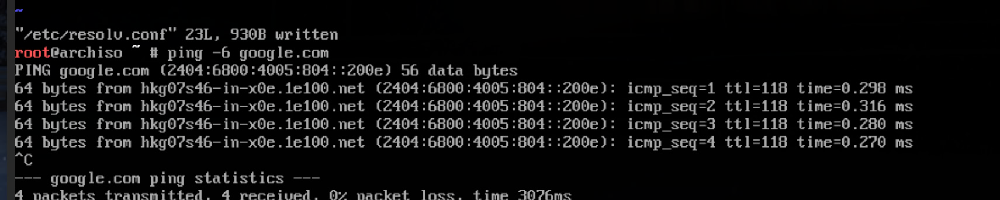
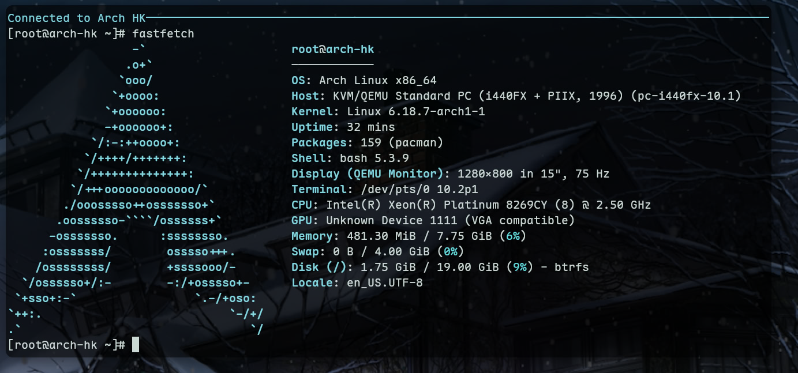

# 02.09 为 IPv6 Only 的机器安装 Arch Linux

有幸安装了一台只有 IPv6 的服务器，过程记录如下。

## 安装系统
使用 Arch Linux 官方的 ISO 镜像，将其作为安装介质启动，并 VNC 连接

### 设置网络

```bash
ip -6 link #查看网卡名称 -> ens18
ip -6 addr add <IPv6 地址>/128 dev ens18 #添加 IPv6 地址
ip -6 route add <IPv6 Router 地址> dev ens18 #添加网关路由
ip -6 route add default via <IPv6 Router 地址> dev ens18 onlink #设置默认路由
```

然后使用 `ping google.com` 测试网络，发现无法解析域名，需要更改 resolver：

```bash
# /etc/resolv.conf
nameserver 2001:4860:4860::8888
...
```

再次 Ping，联通正常


### Arch Install
与常规安装相同，参考 Arch Wiki 的[安装指南](https://wiki.archlinux.org/title/Installation_guide)

## 进入系统

安装完成后，重启进入新系统。由于 `ip` 命令的作用只存放在内存中，无法联网，依然需要设置网络：

我们使用 `systemd-networkd` + `resolved` 来管理网络

> [!TIP]
> 题外话，我在这里遇到了没有 vim/nano/vi 且没有网络的问题
> 
> 解决办法是打完那堆 `ip` 命令后，使用 `echo "nameserver 2001:4860:4860::8888" > /etc/resolv.conf` 来创建 resolver

```bash
# /etc/systemd/network/20-wired.network
[Match]
Name=ens18

[Network]
Address=<IPv6 地址>/128
DNS=2001:4860:4860::8888

[Route]
Destination=<IPv6 Router 地址>
Scope=link

[Route]
Gateway=<IPv6 Router 地址>
GatewayOnLink=yes
```

```bash
systemctl enable --now systemd-networkd
```

使用 `ip -6 addr` 发现地址没有被分配上    
 
`systemctl status systemd-networkd` 查看日志，发现被加载的是 `20-ethernet.network`    

这里我使用 `cp 20-wired.network 20-ethernet.network` 来覆盖掉默认的配置文件

```bash
# /etc/systemd/resolved.conf
[Resolve]
DNS=2001:4860:4860::8888
FallbackDNS=2001:4860:4860::8844
Domains=~.
DNSSEC=no
DNSStubListener=yes
```

```bash
systemctl enable --now systemd-resolved
```



## SSHD

> [!TIP]
> 建议修改默认端口，如 `39901`
>
>  ```bash
>  # /etc/ssh/sshd_config
>  Port 39901
>  ...
>  ```

`systemctl enable --now sshd`

现在可以通过 SSH 连接到这台机器了


