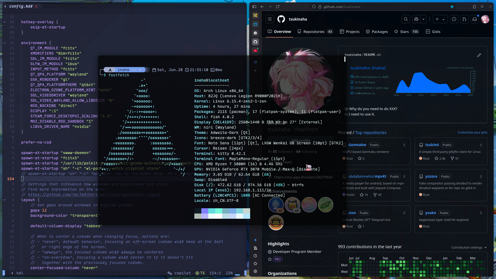

# About
Hi There! I am a CS Undergraduate student at Harbin Engineering University, China. I am interested in Rust and Desktop Linux. 

### How to find me
- Email: [rin@notalium.co](mailto:rin@notalium.co)
- Telegram: [@toushitai](https://t.me/toushitai)
- Matrix: [@inaha:matrix.org](https://matrix.to/#/@inaha:matrix.org)
- GitHub: [tsukinaha](https://www.github.com/tsukinaha)
- osu!: [tsukinaha](https://osu.ppy.sh/users/34279591)
- Steam: [tsukinaha](https://steamcommunity.com/id/tsukinaha/)
- AUR: [tsukinaha](https://aur.archlinux.org/account/Inaha)

### My Laptop

### Some of my attempts
- [Tsukimi](./tsukimi.md): A simple third-party Jellyfin Client written in Rust.
- [danmakw](./POST_2025_06_29_22_50.md): WGPU based danmaku renderer.
- [tomorin](./POST_2025_06_29_22_55.md): Userbot for Telegram.
- [dandanapi](./POST_2025_06_29_23_00.md): Dandan API client. [crates.io](https://crates.io/crates/dandanapi)
- [pkgbuild](./POST_2025_06_29_23_05.md): A collection of PKGBUILDs I have written.
